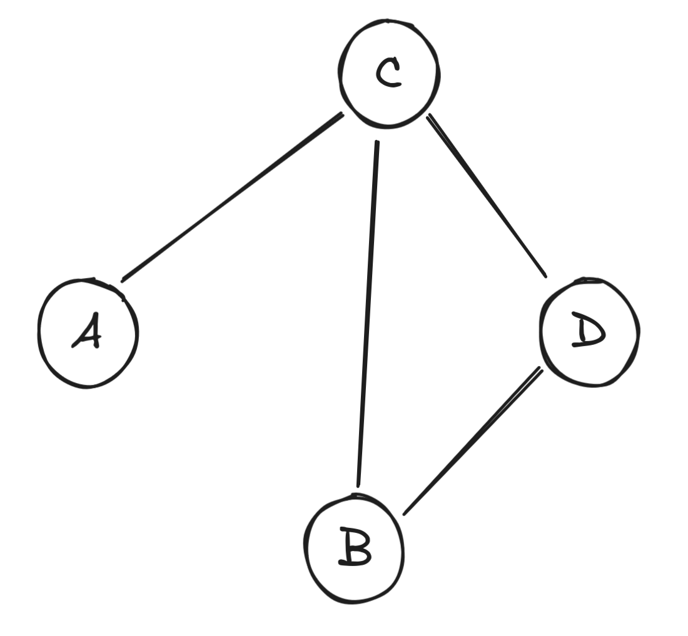

We will now be tackling non-linear data structures. A non-linear data structure is a data structure that doesn't have a "linear" aspect to it. Example of linear data structures are Lists, Linked-Lists, Queues, and Stacks. With these data structures we can clearly define a next and previous element. 

How about the following figure?
Is `C` after or before `A`? What is the next letter after `D`? Can you arrange the elemnts such that there is a **linear structure**?

In this series, we will be talking about the following non-linear data structures.
- Graphs
- Trees
- Binary Heap

