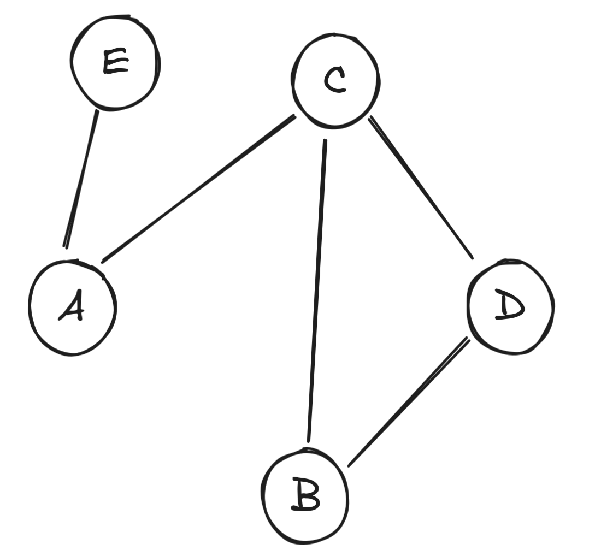

# Graphs

>A graph, usually denoted as $G=(V,E)$, is mathematically defined as collection of vertices $V$ and edges $E$. 
>- A **vertex** is a node associated with some concept; 
>- while an **edge** is a connection between two vertices which may be directed (one-way connection) or undirected (two-way connection). 
>- An edge may have a *weight* or *cost*, which is some value associated with traversing one endpoint vertex to another.

A linked-list can also be treated as a graph where the elements are the vertices and an edge is the pointer.
## Graph Terminologies

Let us first learn the following graph terminologies. Consider the following graph.


* Vertices `u` and `v` are **neighbors** if an edge `(u,v)` that connects them.
	- e.g. `neighbours[c] = {a,b,d}`
* The **degree** of a vertex `v` is the number of edges connected to vertex `v`.
	- e.g. `degree[c] = 3`
* A **path** is a sequence of vertices connected by edges. The **path length** is the number of edges in a path.
	- e.g. `f -> c -> d -> e` is a path of length 3
* A **cycle** is a path that starts and ends at the same vertex.
* Two vertices are **connected** if a path exists between them. A graph where all vertices are connected is a **connected graph**; otherwise the graph is a **disconnected graph**.
* A **connected component** is a subset of vertices that is connected. A connected graph has one connected component while a disconnected graph can have multiple connected components.
## Graph Types

Graph Types are differentiated by three properties. 
1. **Cyclic vs Acyclic Graph** - a graph is said to be acyclic if it contains a cycle and acyclic if otherwise.
2. **Directed vs Undirected Graph** - a graph is **directed** if the edges only connects vertices in one direction; otherwise, it is **undirected**.  In Graph Traversals, an undirected graph is usually interpreted as a **bidirectional** graph since you are not restricted in the direction of traversal.
3. **Weighted vs Unweighted Graphs** - a graph is **weighted** if there is a **cost assosciated** with an edge; it is **unweighted**, if otherwise.

## Graph Code Representations

How do we present the following graph in code? 
There are three main ways in representing graphs in code.
1. Adjacency Matrix
2. Adjacency List
3. Edge List
### Adjacency Matrix
In an **adjacency matrix**, we represent the graph with a 2D array. Each cell `adj[i][j]` contains the weight of the edge from vertex `i` to vertex `j`, or 0 (or a special value like `INF`) if there is no edge between them.

```cpp
#include <iostream>
#include <vector>
using namespace std;

int main() {
    // Number of vertices (5 vertices)
    int V = 5;
    
    // Create an adjacency matrix initialized to 0
    vector<vector<int>> adj(V, vector<int>(V, 0)); // Assuming no edge has weight 0

    // Add the edges with weights (directed graph)
    adj[0][2] = 4;  // Edge from 0 to 2 with weight 4
    adj[4][0] = 10; // Edge from 4 to 0 with weight 10
    adj[2][1] = 7;  // Edge from 2 to 1 with weight 7
    adj[3][1] = -1; // Edge from 3 to 1 with weight -1
    adj[2][3] = 19; // Edge from 2 to 3 with weight 19

    // Display the adjacency matrix
    cout << "Adjacency Matrix:" << endl;
    for (int i = 0; i < V; i++) {
        for (int j = 0; j < V; j++) {
            cout << adj[i][j] << " ";
        }
        cout << endl;
    }

    return 0;
}
```

It has the following representation.
```
Adjacency Matrix:
 0  0  4  0  0 
 0  0  0  0  0 
 0  7  0 19  0 
 0 -1  0  0  0 
10  0  0  0  0 
```

### Edge List

An **edge list** is just a vector of tuples in the form of `<source, destination, weight>`. 

```cpp
#include <iostream>
#include <vector>
using namespace std;

int main() {
    // Edge list representation
    vector<tuple<int, int, int>> edges;

    // Add the edges (from, to, weight)
    edges.push_back({0, 2, 4});
    edges.push_back({4, 0, 10});
    edges.push_back({2, 1, 7});
    edges.push_back({3, 1, -1});
    edges.push_back({2, 3, 19});

    // Display the edge list
    cout << "Edge List:" << endl;
    for (auto& edge : edges) {
        int u, v, w;
        tie(u, v, w) = edge; // Unpack the tuple
        cout << u << " -> " << v << " with weight " << w << endl;
    }

    return 0;
}
```

It has the following output. 
```
Edge List:
0 -> 2 with weight 4
4 -> 0 with weight 10
2 -> 1 with weight 7
3 -> 1 with weight -1
2 -> 3 with weight 19
```

### Adjacency List
In an **Adjacency List**, Graphs can be represented as a mapping of vertices of the graph to the neighbors of each vertex(along with the weight if needed).
```cpp
#include <iostream>
#include <vector>
using namespace std;

int main() {
    // Number of vertices (5 vertices)
    int V = 5;

    // Create an adjacency list (vector of pairs)
    vector<vector<pair<int, int>>> adj(V);

    // Add the edges (from, to, weight)
    adj[0].push_back({2, 4});  // Edge from 0 to 2 with weight 4
    adj[4].push_back({0, 10}); // Edge from 4 to 0 with weight 10
    adj[2].push_back({1, 7});  // Edge from 2 to 1 with weight 7
    adj[3].push_back({1, -1}); // Edge from 3 to 1 with weight -1
    adj[2].push_back({3, 19}); // Edge from 2 to 3 with weight 19

    // Display the adjacency list
    cout << "Adjacency List:" << endl;
    for (int i = 0; i < V; i++) {
        cout << "Vertex " << i << ": ";
        for (auto& neighbor : adj[i]) {
            cout << "(" << neighbor.first << ", " << neighbor.second << ") ";
        }
        cout << endl;
    }

    return 0;
}
```

It has the following output.
```
Adjacency List:
Vertex 0: (2, 4) 
Vertex 1: 
Vertex 2: (1, 7) (3, 19) 
Vertex 3: (1, -1) 
Vertex 4: (0, 10) 
```


### When to use which??

- **Adjacency Matrix:**
    - Best for dense graphs (graphs with many edges).
    - Efficient for algorithms that need to quickly check if an edge exists between two vertices.
- **Edge List:**
    - Best for algorithms like **Kruskal’s algorithm** (MST) or when you need to work with a list of edges directly.
    - Simple to implement and easy to sort.
- **Adjacency List:**
    - Best for sparse graphs where most vertices have few neighbors.
    - Space-efficient and useful for graph traversal algorithms like **DFS** and **BFS**.

Proceed to Graph Algorithms