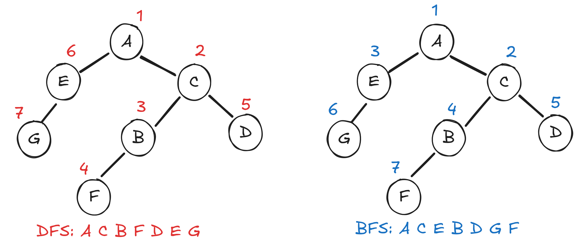

Now that you know some basic knowledge about graphs, we will now discuss algorithms that are used in graph problems.

## Graph Traversals

Graph Traversals are ways in which we "explore" or move around the graph. Let's say you want to count the number of vertices in a specific path or count the number of even nodes, we first need to be able to move around the graph and start counting.

There are two main algorithms for this, **Depth-First Search(DFS)** and **Breadth-First Search(BFS)**. The main difference between the two is that in **DFS** we first go to the deepest node of a neighbor before processing the next neighbor, in **BFS** we first process the neighbours of the node, then go to the neighbor of the neighbors. To illustrate:
For both these algorithms, we need to specify the starting node. If there is a tie on which neighbor to go next, we can specify that depending on our problem statement. 

### Depth-First Search (DFS)

In **DFS**, we use a stack data structure. We first start with the initial node. We then add it's neighbors to the stack. We then get the top element of the stack. This is how we simulate "depth" iteratively. 

```cpp
#include <iostream>
#include <vector>
#include <stack>

using namespace std;

// DFS function using stack (iterative approach)
void dfs(int start, vector<vector<int>>& adjList) {
	stack<int> stk;
	vector<bool> visited = {false};
	stk.push(start);
	vector<string> labels = {
		"A", "B", "C", "D", "E", "F", "G"
	}; // just labeling the nodes
	
	visited[start] = true;
	
	while (!stk.empty()) {
		int node = stk.top();
		stk.pop();
		cout << labels[node] << " ";
		
		// Explore the neighbors
		for (int neighbor : adjList[node]) {
			if (!visited[neighbor]) {
				visited[neighbor] = true;
				stk.push(neighbor);
			}
		}
	}
}

int main() {  
	int V = 7;
	vector<vector<int>> adj(V);
	  
	adj[0].push_back(4);
	adj[0].push_back(2);
	adj[1].push_back(5);
	adj[2].push_back(3);
	adj[2].push_back(1);
	adj[4].push_back(6);
	
	dfs(0, adj);
	
	return 0;
}
```

The output will be
```
A C B F D E G 
```
### Breadth-First Search (BFS)

In BFS, we use a queue data structure. We start by placing the initial start inside the queue. While the queue isn't empty, we process the first element then add it's neighbors to the end of the queue. We do this to ensure that **whatever was added first will be processed first**.

```cpp
#include <iostream>
#include <vector>
#include <queue>
using namespace std;

void BFS(int start, const vector<vector<int>>& adj, int V) {
	vector<bool> visited(V, false);
	queue<int> q;
	vector<string> labels = {
		"A", "B", "C", "D", "E", "F", "G"
	}; // just labeling the nodes
	
	visited[start] = true;
	q.push(start);
	while (!q.empty()) {
		int node = q.front();
		q.pop();
		cout << labels[node] << " ";
		for (int neighbor : adj[node]) {
			if (!visited[neighbor]) {
				visited[neighbor] = true;
				q.push(neighbor);
			}
		}
	}
}

int main() {
	int V = 7;
	vector<vector<int>> adj(V);
	  
	adj[0].push_back(2);
	adj[0].push_back(4);
	adj[1].push_back(5);
	adj[2].push_back(1);
	adj[2].push_back(3);
	adj[4].push_back(6);
	BFS(0, adj, V); // Start BFS from vertex 0
}
```

The output will be
```
A C E B D G F 
```

### Don't forget to mark your visit!

When doing graph problems, it is essential to mark the nodes you have already visited. This is to avoid the source node to be visited by the neighbor. 

## Common Problem Cases

The realm of graph theory is vast but it is important to get the basics polished as most problems can be derived from these basics. 

### Shortest Path

```
Given a weighted graph. What is the shortest path from vertex 0 to vertex n.
```

The shortest path problem is one the most popular problems in graph theory. There are different kinds of algorithms to solve the shortest path problem. 

Notice how it is better to take a detour to `D` then go straight to `C`.

#### Djikstra's Algortihm

The idea of Djikstra's Algorithm is to relax the weights using the smallest distance node.

```cpp
#include <iostream>
#include <vector>
#include <queue>
#include <climits>

using namespace std;

void dijkstra(int start, int n, vector<vector<pair<int, int>>>& adjList) {
    // Distance vector, initialized to infinity for all nodes except the start
    vector<int> dist(n, INT_MAX);
    dist[start] = 0;

    // Priority queue to select the node with the smallest tentative distance
    priority_queue<pair<int, int>, vector<pair<int, int>>, greater<pair<int, int>>> pq;

    // Push the start node to the queue with distance 0
    pq.push({0, start});

    // Process the priority queue
    while (!pq.empty()) {
        // Get the node with the smallest distance
        int uDist = pq.top().first;
        int u = pq.top().second;
        pq.pop();

        // If the current distance is greater than the already found distance, skip it
        if (uDist > dist[u]) continue;

        // Explore all neighbors of the current node u
        for (auto& neighbor : adjList[u]) {
            int v = neighbor.first; // Neighbor node
            int weight = neighbor.second; // Edge weight

            // Relaxation step: If we find a shorter path to v, update its distance
            if (dist[u] + weight < dist[v]) {
                dist[v] = dist[u] + weight;
                pq.push({dist[v], v});
            }
        }
    }

    // Print the shortest distance to all nodes
    cout << "Shortest distances from node " << start << ":\n";
    for (int i = 0; i < n; ++i) {
        if (dist[i] == INT_MAX)
            cout << "Node " << i << ": INF\n";
        else
            cout << "Node " << i << ": " << dist[i] << endl;
    }
}

int main() {
    int n, m;
    cout << "Enter the number of nodes and edges: ";
    cin >> n >> m;

    // Adjacency list for the graph
    vector<vector<pair<int, int>>> adjList(n);

    cout << "Enter the edges (u v w) where u and v are the nodes and w is the weight:\n";
    for (int i = 0; i < m; ++i) {
        int u, v, w;
        cin >> u >> v >> w;
        adjList[u].push_back({v, w});
        adjList[v].push_back({u, w}); // For undirected graph
    }

    int source;
    cout << "Enter the source node: ";
    cin >> source;

    // Run Dijkstra's algorithm from the source node
    dijkstra(source, n, adjList);

    return 0;
}

```

### Connected Components

```
Given a graph. Count the number of connected components. E.g. How many connected groups are there, where it is not connected to any other group?
```

There are three connected components in the graph below.
]]
#### Connected Components Code
Using bfs, we can just loop through all the vertices. Check if it is visited, if it is not visited add 1 to the number of groups. 

```cpp
#include <iostream>
#include <vector>
#include <queue>

using namespace std;

// BFS function to explore a component
void bfs(int startNode, vector<vector<int>>& adjList, vector<bool>& visited) {
    queue<int> q;
    visited[startNode] = true;
    q.push(startNode);

    while (!q.empty()) {
        int node = q.front();
        q.pop();

        // Explore all the neighbors of the current node
        for (int neighbor : adjList[node]) {
            if (!visited[neighbor]) {
                visited[neighbor] = true;
                q.push(neighbor);
            }
        }
    }
}

int main() {
    int n, m;
    cout << "Enter number of nodes and edges: ";
    cin >> n >> m;

    // Adjacency list for the graph
    vector<vector<int>> adjList(n);

    cout << "Enter " << m << " edges (u v):\n";
    for (int i = 0; i < m; ++i) {
        int u, v;
        cin >> u >> v;
        adjList[u].push_back(v);
        adjList[v].push_back(u); // For undirected graph
    }

    vector<bool> visited(n, false);
    int connectedComponents = 0;

    // Count connected components using BFS
    for (int i = 0; i < n; ++i) {
        if (!visited[i]) { // If the node is not visited, it's a new component
            bfs(i, adjList, visited);
            connectedComponents++; // Increment the count for this component
        }
    }
    cout << "Number of connected components: " << connectedComponents << endl;
    return 0;
}
```


### 2-Color Graph

```
Given a graph. Is it possible to color the graph using two colors such that no two adjacent vertices share the same color.
```

Additional note, if such a coloring is possible, the graph is called **bipartite**. A graph is bipartite if and only if it does not contain any odd-length cycles. But we can also solve this using BFS. 

#### Bipartite Graph?

```cpp
#include <iostream>
#include <vector>
#include <queue>

using namespace std;

bool isBipartite(int n, const vector<vector<int>>& adjList) {
    vector<int> color(n, -1);  // -1 means uncolored, 0 and 1 will be the two colors

    // Iterate over all nodes, since the graph might be disconnected
    for (int start = 0; start < n; ++start) {
        if (color[start] == -1) {  // If the node hasn't been colored yet
            // Perform BFS starting from the uncolored node
            queue<int> q;
            q.push(start);
            color[start] = 0;  // Start coloring the source node with color 0

            while (!q.empty()) {
                int u = q.front();
                q.pop();

                // Explore all neighbors of the current node
                for (int v : adjList[u]) {
                    if (color[v] == -1) {
                        // If the neighbor hasn't been colored, color it with the opposite color
                        color[v] = 1 - color[u];
                        q.push(v);
                    } else if (color[v] == color[u]) {
                        // If the neighbor has the same color, the graph is not bipartite
                        return false;
                    }
                }
            }
        }
    }
    return true;  // If we managed to color the entire graph without conflicts
}

int main() {
    int n, m;
    cout << "Enter number of nodes and edges: ";
    cin >> n >> m;

    // Adjacency list for the graph
    vector<vector<int>> adjList(n);

    cout << "Enter " << m << " edges (u v):\n";
    for (int i = 0; i < m; ++i) {
        int u, v;
        cin >> u >> v;
        adjList[u].push_back(v);
        adjList[v].push_back(u);  // For undirected graph
    }

    // Check if the graph is bipartite
    if (isBipartite(n, adjList)) {
        cout << "The graph is bipartite (2-colorable)." << endl;
    } else {
        cout << "The graph is not bipartite." << endl;
    }

    return 0;
}

```