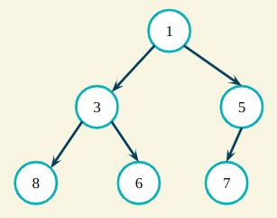
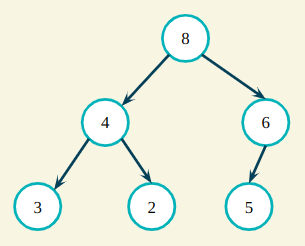
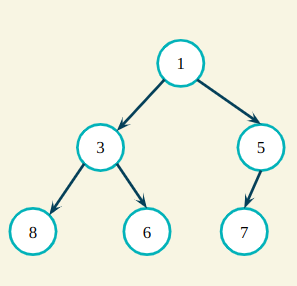
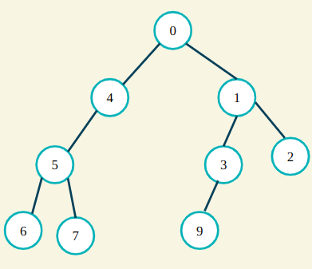
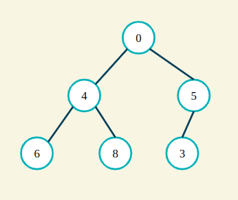
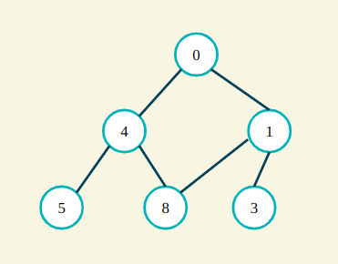

# Binary Heaps

Heaps are data structures that fulfill two conditions:

1. It is a **complete binary tree**, which is simply a tree where each node has at most two children (binary) and each level, except the last one, has to be filled (complete).
2. It follows the **heap property**.

## Heap Property (aka Heap Invariant)

_Invariant is just a fancy word to mean "this is always true for this thing"._

In a **max heap**, the heap invariant is that every node in the tree is bigger than its children.

In a **min heap**, the heap invariant is that every node in the tree is smaller than its children.

## Exercise

Take a minute to identify whether or not the following are heaps, and why (assume these are all supposed to be min heaps).

\
\
\
\
\
\
\
\
\
\
\
\
Answer: None of these are heaps.

The first structure is not a complete tree. The second structure violates the heap invariant. And the third structure isn't a tree at all.
