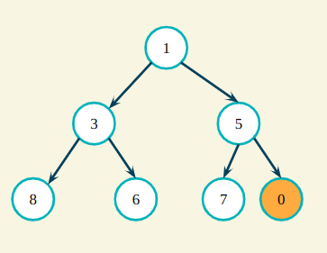
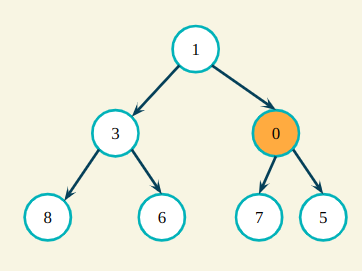
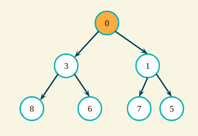
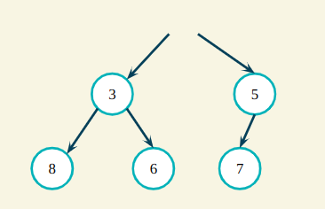
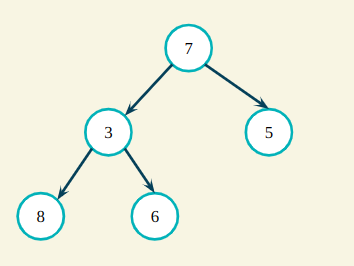
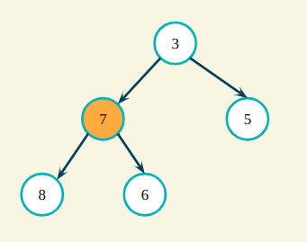
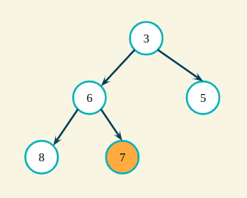

# Binary Heap Operations

### Get Min / Get Max

Since the root of a binary heap is always its min/max value, _get_min()_ and _get_max()_ cost _O(1)_, which is trivially more efficient than in a linear array.

### Insert

Step 1: Insert new element

Step 2: "Heapify" -- swap the new element with its parent until the heap invariant is preserved.

Observe how the number of swaps is always at most the length of one side of the tree. This means the cost of heap insertion is _O(log n)_.

This also means that to build a heap of size _n_, which is to insert _n_ elements, costs _O(n _ log n)\*.

### Delete

Step 1: Delete root node

Step 2: Move last element to the top

Step 3: "Heapify" - check from left to right if there are violations of the heap invariant - swap down until heap invariant is preserved

Just as in insertions, the maximum number of swaps required to maintain the heap invariant is _O(n)_.

Observe how heaps are not optimized for deleting non-root elements. To delete a specific node, one will have to keep deleting up to _n_ nodes until that node becomes the root. In this case, deleting a specific node costs _O(n _ log n)\*.

### Summary

| Operation   | Cost          |
| ----------- | ------------- |
| Get max/min | O(1)          |
| Insert      | O(log n)      |
| Build heap  | O(n \* log n) |
| Delete      | O(log n)      |
| Search      | O(n)          |
